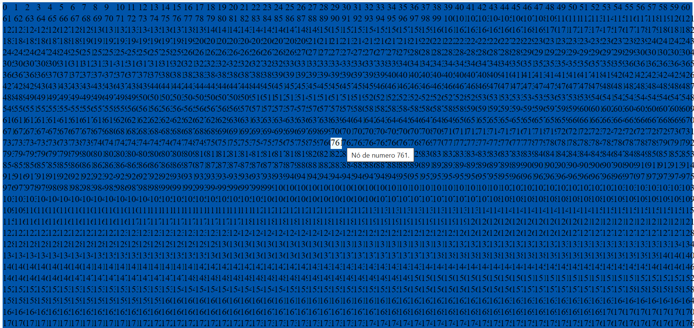
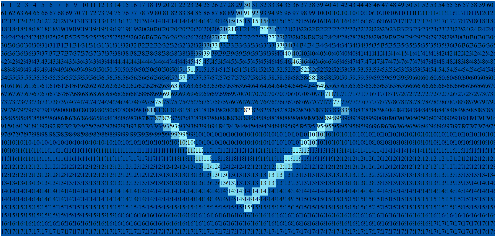
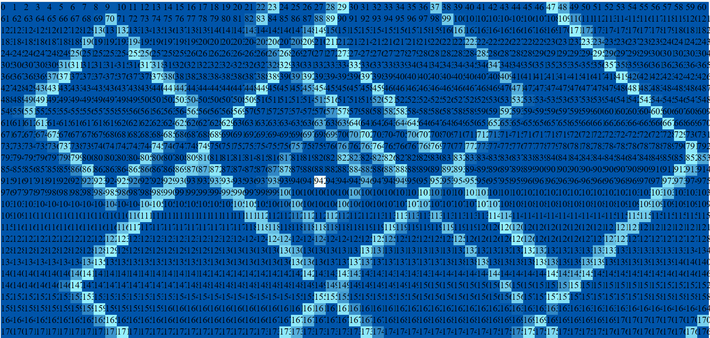

# Onda

**Número da Lista**: X 
**Conteúdo da Disciplina**: Flood fill 

## Alunos
|Matrícula | Aluno |
| -- | -- |
| 18/0128817  |  Pablo Santos Costa |

## Sobre 
Nesse projeto busco realizar uma busca em largura inspirado no flood fill, isso em uma velocidade controlada para poder visulizar as camadas em forma de onda.
Toda solicitação roda de forma simultanea em seu navegador local, com isso pude hospedar o software em funcionamento no [GitPages][gps], assim facilitando o uso.

## Screenshots

## Instalação 
**Linguagem**: Tipescript 
**Framework**: Angular 

### Pré-requisitos

- node & npm atualizados

### Rodar como desenvolvedor

#### Ambiente
Vá para a pasta do projeto Angular `cd onda` e instale as dependencias `npm i -g`.

#### Rodando..
Execulte o comando `ng serve` para rodar o servidor de desenvolvimento. Navegue em `http://localhost:4200/`. A aplicação será atualizada automaticamente assim que tiver qualquer alterações salvas nos arquivos.

## Uso 
Após a execulção basta clicar na representação grafica do nó e ver a busca em largura acontecer em forma de onda.

## Outros 
Dependendo de quantas solicitações de busca, hardware ou resolução da tela o desenpenho do software vária.

[gps]:[https://projeto-de-algoritmos-2024.github.io/Grafos1_Onda/]

